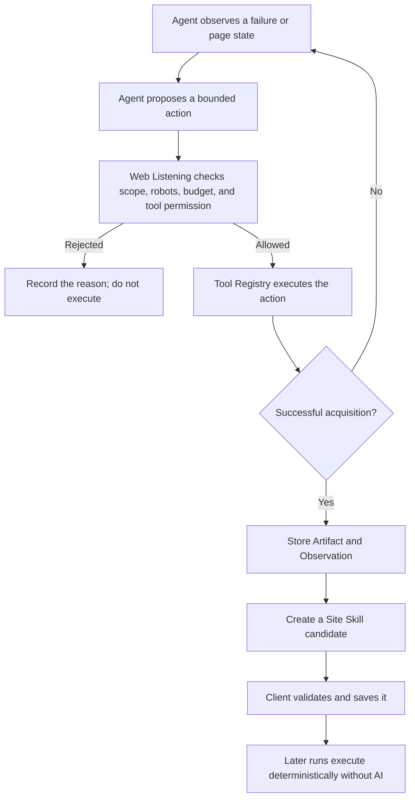
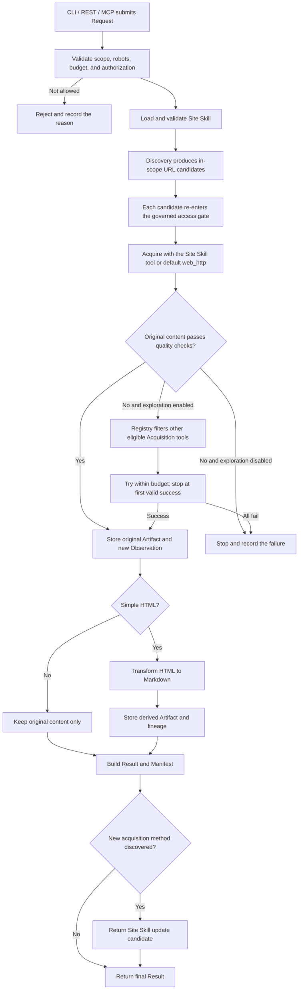
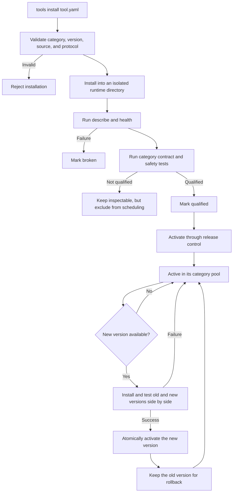

# Web Listening Modular Redesign

> Status: Proposed target design; Issue #72 shallow-CI-safe offline evidence complete; replacement authorized Live and independent I/O audit, required CI, and separate production-switch authorization pending
> Audience: Product owners, client developers, tool integrators, and maintainers  
> Important: This document describes the intended future design, not functionality already enabled in the current repository.

## 1. Purpose

Web Listening is a governed website acquisition tool for both people and software agents.

A caller tells it:

- which websites and paths are in scope;
- whether it needs web pages, downloadable files, or both;
- whether it has a previously saved Site Skill;
- whether Web Listening may explore other eligible tools after a failure;
- how much time, traffic, and work the run may consume.

Web Listening then:

- discovers in-scope pages and files;
- chooses an eligible acquisition tool;
- stores original HTML and downloaded files;
- optionally converts simple HTML into Markdown;
- creates a new observation for every successful target acquisition;
- produces one consistent manifest;
- records every tool attempt and failure reason;
- returns a new Site Skill candidate when it discovers a better working method.

Web Listening is not a PDF, Word, or Excel parser. It is also not a RAG, search, question-answering, or content-analysis system.

## 2. Core Product Model

The product is organized around five business modules:

```text
Request → Site Skill → Tool Registry → Artifact → Result
```

| Module | Plain-language responsibility | It must not do |
|---|---|---|
| Request | Define where the run may go, what it may collect, and how much it may spend | Name or control individual tools |
| Site Skill | Describe the last verified way to work with a site | Expand the Request or perform network access |
| Tool Registry | Manage tools, choose an eligible tool, and execute it | Write final Artifacts, Manifests, or Site Skills |
| Artifact | Store original and derived content with immutable identities | Access websites or choose tools |
| Result | Deliver a consistent result and explain what happened | Re-run tools or modify stored originals |

Two small supporting layers are allowed:

- **Runtime** connects the five modules in a fixed order.
- **Interfaces** translate CLI, REST, and MCP calls into the same Request and Result.

Runtime is not a sixth business authority. Interfaces may not implement their own tool selection or acquisition logic.

## 3. Designed for Agents, but Not Dependent on AI

The Web Listening core does not require AI or an OpenAI API key.

Playwright, CloakBrowser, and BrowserAct can all be treated as browser execution tools: they receive explicit actions, perform them, and return results.

- Playwright does not require AI.
- CloakBrowser does not require AI.
- BrowserAct is designed for agent-friendly browser control, but fixed BrowserAct commands do not inherently require AI.

The recommended relationship is:

```text
ChatGPT / Codex / another agent
              ↓ MCP or REST
Web Listening deterministic core
              ↓
Discovery / Acquisition / Transform tools
```

Without an agent, CLI and REST clients can still run the complete standard workflow. With an agent, MCP provides the same governed capability.

### 3.1 Where AI can help

AI is most useful during first-time exploration of an unfamiliar site or when a saved Site Skill stops working. It may help decide:

- which visible element to click;
- where the main content is located;
- how to expose a download link;
- which bounded browser action to try next;
- how to propose a replacement Site Skill.

AI may propose an action, but Web Listening remains the authority that decides whether the action is allowed.



AI must not:

- expand scope;
- open an unauthorized target URL;
- bypass robots or policy decisions;
- write directly to the Artifact Store;
- write a Manifest or activate a Site Skill directly;
- send page content to an external model provider by default.

The first version should keep AI outside the Web Listening core. This avoids mandatory model cost, API keys, data transfer, and vendor lock-in.

## 4. Site Skill as Structured Operational Memory

A Site Skill is structured operational memory created after successful exploration.

It is not an AI model, a prompt, or an unrestricted script.

It records:

- how the site last exposed useful URLs;
- which acquisition tool succeeded;
- which bounded browser actions were required, if any;
- how success was checked;
- which tool version was verified;
- when the recipe was verified;
- which prior Site Skill version it replaces.

Example:

```yaml
site_key: example.org
version: 3

discovery:
  tool_id: sitemap

acquisition:
  tool_id: browseract
  steps:
    - navigate: https://example.org/reports/
    - wait_for: "#reports"
    - click: "[data-year='2026']"
    - extract_links: "a[href$='.pdf']"

success_checks:
  allowed_mime_types: [application/pdf]
  minimum_files: 1

verified_at: 2026-08-24T00:00:00Z
previous_digest: sha256:...
digest: sha256:...
```

A Site Skill must not contain:

- secrets, cookies, or login credentials;
- arbitrary Python, shell, or JavaScript code;
- unrestricted external commands;
- access authority beyond the caller's Request.

### 4.1 Site Skill lifecycle

```text
No Site Skill
    → bounded exploration succeeds
    → return Site Skill v1

Client sends Site Skill v1 later
    → execute the verified recipe directly
    → no repeated exploration

Site Skill v1 stops working
    → explore only when authorized
    → return Site Skill v2 candidate
    → client saves v2 and retains v1 for rollback
```

The Site Skill is a client-owned input and output. Web Listening may return an update candidate, but it must not silently replace the client's active version.

For a multi-site run, the batch Result makes that handoff explicit. Each usable site
gets a persisted `next_refresh_context`: replay keeps the Site Skill that actually
worked, while governed recovery binds a validated replacement candidate to the
new Current State. The replacement retains `previous_digest`, so the caller can
audit or roll back the lineage. Coverage evidence such as `truncated` or `unknown`
does not erase content already acquired successfully.

## 5. Simple Request Contract

The common Request should expose only four important inputs:

| Field | Meaning |
|---|---|
| `scope` | Seed URLs, allowed origins, allowed paths, and requested content types |
| `site_skill` | The client-owned Site Skill, or `null` on a first run |
| `explore_all_tools` | Whether Web Listening may try other eligible tools after a failure; default `false` |
| `budgets` | Request, byte, runtime, and per-target tool-attempt limits |

Example:

```json
{
  "scope": {
    "seeds": ["https://example.org/reports/"],
    "allowed_origins": ["https://example.org"],
    "include_paths": ["/reports/**"],
    "content_types": ["html", "file"]
  },
  "site_skill": null,
  "explore_all_tools": true,
  "budgets": {
    "max_requests": 100,
    "max_bytes": 104857600,
    "max_runtime_seconds": 600,
    "max_tool_attempts_per_target": 4
  }
}
```

The public contract should not require callers to provide:

```text
authorized_tool_ids
authorization_reference
```

`explore_all_tools=true` does not mean “run any installed program.” It means Web Listening may select from the intersection of tools that are:

```text
registered
∩ installed
∩ qualified
∩ healthy
∩ capability-compatible
∩ policy-compliant
∩ within budget
```

## 6. Consistent Result Contract

CLI, REST, and MCP should return the same logical Result:

| Field | Meaning |
|---|---|
| `status` | `completed`, `partial`, `rejected`, or `failed` |
| `artifacts` | Stored HTML, Markdown, and downloaded files |
| `manifest` | URLs, times, hashes, tool versions, observations, and lineage |
| `site_skill_used` | The Site Skill actually used for the run |
| `site_skill_update` | A new candidate for the client to validate and save |
| `attempts` | Every tool attempt and its outcome |
| `errors` | Stable, safe error codes |
| `usage` | Actual requests, bytes, runtime, and tool attempts consumed |

The Manifest must explain at least:

- requested and final URLs;
- acquisition time and run identity;
- HTTP status, MIME type, size, and SHA-256;
- tool ID and version;
- redirects;
- the Site Skill version and digest;
- each failed or skipped attempt and its reason;
- Artifact lineage, including which Markdown came from which HTML;
- actual budget consumption.

The Manifest must not contain cookies, tokens, authorization headers, or other secrets.

## 7. Immutable Snapshot and Observation Model

Every successful target-content acquisition creates a new immutable **Observation**.

This rule is essential for website monitoring.

```text
Successful visit on Day 1
    → Observation A
    → HTML SHA-256: abc...

Successful visit on Day 2
    → Observation B
    → HTML SHA-256: abc...
```

If the bytes are unchanged:

- the content-addressed Blob may be reused;
- a new Observation is still created for the new visit;
- the system can prove that the site was checked again and did not change.

If the bytes changed:

```text
Observation A → Blob SHA-256: abc...
Observation B → Blob SHA-256: xyz...
```

The new Blob is stored and the change is visible through the observation history.

### 7.1 What a successful Observation records

- run and request identity;
- requested, current, and final URL;
- acquisition time;
- HTTP status;
- original HTML or downloaded-file Artifact identity;
- content SHA-256, MIME type, and size;
- acquisition tool ID and version;
- Site Skill version and digest;
- redirect and access-decision evidence;
- source and derived Artifact lineage.

### 7.2 What does not create a content snapshot

The following may create attempt or policy evidence, but not a successful content Observation:

- robots rejection;
- out-of-scope candidates;
- failed or timed-out acquisition;
- tool startup or health-check failure;
- a discovered URL that has not been acquired;
- browser subresources such as CSS, fonts, and images unless they are explicit acquisition targets.

The model is:

```text
Every successful target acquisition
             ↓
Create a new immutable Observation
             ↓
Same bytes: reuse the Blob
Changed bytes: store a new Blob
             ↓
Compare Observations to detect change
```

## 8. Three Tool Categories

Tools are divided by responsibility:

```text
Discovery: find URLs
      ↓
Acquisition: retrieve HTML or files
      ↓
Transform: convert content already acquired
```

| Category | Input | Output | Examples |
|---|---|---|---|
| Discovery | Scope and seeds | URL candidates | Sitemap, RSS, page-link discovery |
| Acquisition | One governed target URL | Original HTML or file | `web_http`, Playwright, CloakBrowser, BrowserAct |
| Transform | A stored Artifact | A derived Artifact | HTML-to-Markdown |

Distribution is a separate property:

```text
distribution: builtin | installed
```

Valid combinations include:

- built-in Discovery tool;
- installed Discovery tool;
- built-in Acquisition tool;
- installed CloakBrowser Acquisition tool;
- built-in simple HTML-to-Markdown Transform;
- installed advanced Markdown Transform.

What a tool does and how it is distributed must not be treated as the same concept.

## 9. Runtime Flow



Tool switching must never be used to bypass:

- robots rejection;
- scope limits;
- security or policy rejection;
- exhausted budget;
- missing tool qualification or authorization.

Fallback is not a hard-coded chain such as:

```text
HTTP → Playwright → CloakBrowser
```

The Registry first removes ineligible tools, then ranks the remaining tools by capability, verified site history, reliability, cost, and risk.

## 10. External Tool Integration

An external tool does not need to become part of the Web Listening source repository.

If it does not implement the Web Listening protocol natively, a thin Adapter translates between the two systems:

```text
Web Listening standard request
             ↓
External-tool Adapter
             ↓
CloakBrowser or another external tool
             ↓
Adapter normalizes the response
             ↓
Web Listening standard tool result
```

An external Acquisition tool receives:

- one explicit target URL;
- allowed origins;
- timeout, size, and redirect limits;
- a temporary directory restricted to the current attempt;
- a controlled proxy or restricted network configuration.

It returns:

- `success`, `failed`, or `rejected`;
- requested and final URL;
- HTTP status;
- MIME type;
- a relative path to HTML or file output inside the attempt directory;
- redirect evidence;
- tool ID, version, and elapsed time;
- a stable, safe error code when unsuccessful.

Web Listening independently rechecks the URL, path, size, MIME type, and SHA-256 before moving content into the Artifact Store.

An external tool must not write directly to the final Artifact Store, Manifest, or Site Skill.

## 11. Browser Acquisition Tools

Playwright, CloakBrowser, and BrowserAct all belong to the Acquisition category.

| Tool | Intended role | AI required? |
|---|---|---:|
| Playwright | Standard rendered-browser automation | No |
| CloakBrowser | Browser acquisition where qualified anti-detection behavior is required | No |
| BrowserAct | Agent-friendly browser control | No for fixed commands; AI is only needed when an agent chooses actions dynamically |

The current Web Listening 3.1 product explicitly disables production target reads through these browser tools. Future enablement requires all of the following:

- a versioned Adapter;
- a pinned and recorded tool version;
- installation in an isolated runtime;
- health and protocol qualification;
- scope, redirect, timeout, and output-bound tests;
- controlled-proxy support or a network environment restricted to the Request scope;
- explicit authorization;
- disable and rollback support.

A browser tool with unrestricted network access that cannot use a controlled proxy or network isolation may be installed and inspected, but it must not enter the automatic exploration pool.

## 12. HTML-to-Markdown as an Independent Transform

HTML-to-Markdown is not website acquisition.

```text
Acquisition Tool
      ↓ original HTML
Artifact Store
      ↓
Transform Tool
      ↓
Markdown Artifact
```

The first version should include one built-in Transform:

```text
simple_html_markdown
```

Rules:

1. Do not transform non-HTML content.
2. Do not transform HTML that is too complex or does not meet the simple-content quality rule.
3. Use the default Transform for eligible simple HTML.
4. Store the Markdown as a derived Artifact with source and tool-version lineage.
5. If transformation fails, keep the original HTML and record the Transform failure.
6. A Transform failure must not trigger Playwright, CloakBrowser, BrowserAct, or any new website acquisition.

Additional Transform tools may be installed later. Transform tools should have no network access by default.

## 13. Tool Installation, Upgrade, and Rollback



Installed tools live outside the source tree:

```text
web-listening-data/tools/
├─ discovery/
├─ acquisition/
│  └─ cloakbrowser/1.0.0/
└─ transform/
   └─ readability-markdown/2.0.0/
```

Adding, upgrading, disabling, or rolling back an external tool must not require changes to CLI, REST, MCP, or the core workflow.

## 14. CLI, REST, and MCP

All three interfaces are thin adapters over one Runtime service.

### CLI

```bash
web-listening acquire \
  --scope scope.yaml \
  --site-skill site-skill.yaml \
  --explore-all-tools \
  --output ./output \
  --json
```

### REST

```text
POST /v1/acquisitions
GET  /v1/jobs/{run_id}
GET  /v1/artifacts/{artifact_id}
```

### MCP

```text
web_listening_acquire
web_listening_get_job
web_listening_read_artifact
web_listening_validate_site_skill
```

An agent calls `web_listening_acquire`; it does not invoke CloakBrowser or Playwright directly. Web Listening remains responsible for authorization, selection, execution, storage, and audit records.

## 15. Proposed Source Layout

```text
src/web_listening/
├─ request/                       # What is allowed
│  ├─ model.py
│  ├─ scope.py
│  ├─ budgets.py
│  └─ validate.py
│
├─ site_skill/                    # What worked for this site before
│  ├─ model.py
│  ├─ validate.py
│  ├─ resolve.py
│  ├─ update.py
│  └─ repository.py
│
├─ tool_registry/                 # Which tools exist and how they run
│  ├─ manifest.py
│  ├─ registry.py
│  ├─ lifecycle.py
│  ├─ eligibility.py
│  ├─ protocols/
│  │  ├─ discovery.py
│  │  ├─ acquisition.py
│  │  └─ transform.py
│  ├─ runners/
│  │  ├─ in_process.py
│  │  ├─ subprocess.py
│  │  └─ isolated_runtime.py
│  ├─ discovery/
│  │  └─ builtins/
│  │     ├─ sitemap.py
│  │     └─ rss.py
│  ├─ acquisition/
│  │  └─ builtins/
│  │     └─ web_http.py
│  └─ transform/
│     └─ builtins/
│        └─ simple_html_markdown.py
│
├─ artifact/                      # Immutable original and derived content
│  ├─ model.py
│  ├─ store.py
│  ├─ identity.py
│  ├─ observation.py
│  └─ lineage.py
│
├─ result/                        # Consistent delivery
│  ├─ model.py
│  ├─ manifest.py
│  ├─ attempts.py
│  └─ errors.py
│
├─ runtime/                       # Connects the five modules only
│  ├─ service.py
│  ├─ workflow.py
│  └─ jobs.py
│
└─ interfaces/                    # Thin transport adapters
   ├─ cli.py
   ├─ rest.py
   └─ mcp.py
```

External tools are registered and executed from the data directory, not placed under `src/`.

## 16. Independence Rules

- Request does not know individual tool names.
- Site Skill stores only structured, validated recipes and never executes arbitrary code.
- Tool Registry returns standard tool results and does not write Artifacts, Manifests, or Site Skills.
- Artifact never accesses a website.
- Result never re-runs a tool.
- Runtime does not duplicate rules owned by the five business modules.
- CLI, REST, and MCP never invoke low-level tools directly.
- Discovery, Acquisition, and Transform have separate protocols and failure behavior.
- External tool runtimes remain isolated from the core Python environment.
- Standard operation works without AI.
- AI remains an optional external explorer and repair assistant.
- Every successful target acquisition creates a new immutable Observation.
- Blob deduplication must never erase visit history.

## 17. Repository Strategy

Create a new repository for the new architecture. Do not completely overwrite the current repository on one branch.

The current repository contains several mature but very large modules. A complete replacement would produce a change that is difficult to review, verify, and roll back.

Start the new repository with:

```text
Request → Site Skill → Tool Registry → Artifact → Result
```

Then migrate mature capabilities one at a time:

- the unified governed access gateway;
- robots, scope, redirect, and budget rules;
- immutable Blob, Observation, and Artifact storage;
- Manifest identity and lineage;
- Site Skill digest, version, and secret checks;
- job state and stable error codes.

Do not cherry-pick large old modules as a default. That risks carrying old dependencies and architecture into the new system. Port behavior behind the new contracts and preserve the proven tests.

## 18. Recommended Delivery Order

1. Freeze the Request, Site Skill, Tool, Artifact, Observation, Manifest, and Result contracts.
2. Build the smallest end-to-end path with built-in `web_http`.
3. Prove that every successful run creates a new Observation while identical bytes reuse the Blob.
4. Add Sitemap/RSS Discovery and simple HTML-to-Markdown Transform.
5. Add Site Skill generation, client round-trip, update, and rollback behavior.
6. Add external tool installation, qualification, upgrade, disable, and rollback.
7. Integrate one no-network external Transform tool first.
8. Integrate a CloakBrowser Adapter and qualify its governed network boundary.
9. Add controlled `explore_all_tools` switching.
10. Add optional agent-assisted exploration last.
11. Run a small set of real sites through both old and new systems and compare Artifacts, Observations, Manifests, success rates, costs, and failure explanations.

## 19. Acceptance Criteria

The first production-ready version must prove that:

1. CLI, REST, and MCP normalize to the same Request and Result behavior.
2. Standard acquisition runs without AI or an external model key.
3. An agent can call the same governed workflow through MCP.
4. A valid Site Skill avoids repeated exploration.
5. A Site Skill update is returned as a candidate and never silently activated.
6. `explore_all_tools=false` prevents acquisition-tool switching.
7. `explore_all_tools=true` uses only eligible, qualified, compliant tools.
8. Robots, scope, security, and budget rejection can never be bypassed by fallback.
9. Every successful target acquisition creates a new immutable Observation.
10. Identical content reuses the Blob without losing the new Observation.
11. Changed content creates a new Blob and remains comparable to prior Observations.
12. Failed attempts retain safe evidence but do not create successful content snapshots.
13. Transform failure preserves original HTML and never triggers new Acquisition.
14. External tools cannot write final Artifacts, Manifests, or Site Skills directly.
15. External tool upgrades support side-by-side qualification, atomic activation, and rollback.
16. Adding a conforming tool does not change the public CLI, REST, or MCP Request shape.

Availability-first batch acceptance is implemented as a strict `first`/`refresh`
Request and Result boundary. Sites run serially with independent per-site budgets;
only explicit cancellation stops later sites. Results expose
`replayed | recovered | failed`, `usable_site_keys`, exact aggregate Usage, and
strictly round-trippable `next_refresh_contexts`. The fixed SOA/CAS/IAA live proof
remains opt-in and requires an explicit authorization window.

## 20. Final Positioning

```text
Web Listening = deterministic, governed, repeatable website acquisition
Site Skill     = structured operational memory created after successful exploration
AI Agent       = optional first-time explorer and repair assistant
Browser Tools  = execution tools, not policy authorities
Observation    = one immutable record of one successful target acquisition
Blob           = deduplicated content bytes shared when identical
Artifact       = trusted original or derived content
Result         = one consistent delivery for people and agents
```

The most important outcome is:

> An agent may explore once and leave behind a Site Skill. Later runs can execute predictably without AI or repeated exploration, while every successful visit still creates a new immutable observation for monitoring and change detection.

Phase 20 applies this model availability-first across sites: each authorized site
gets its own bounded ledger, saved recipes recover through the same governed
single-site path, and successful HTML, Markdown, or download evidence remains
deliverable even when discovery coverage is incomplete. Coverage reports what was
proved; it does not decide whether verified Current pages are usable.
